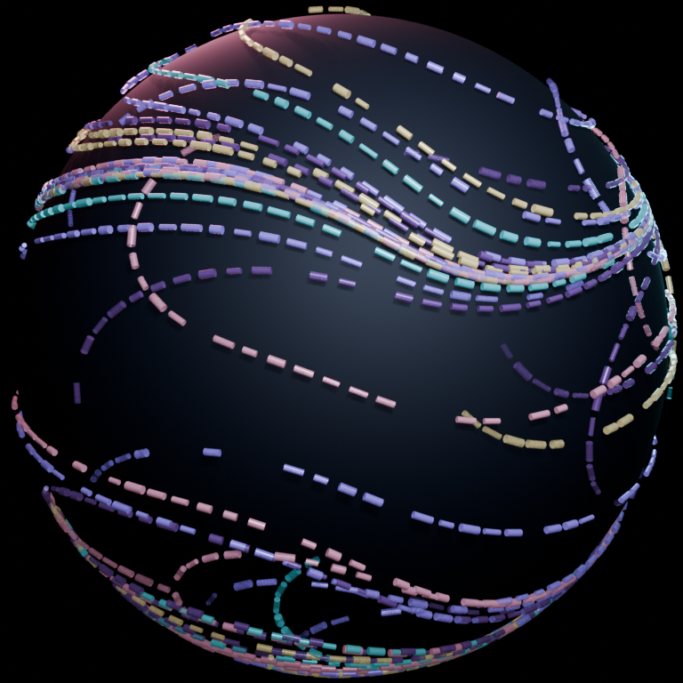

# Blender generative-art prototypes

## Flow Field Painter 0.3

Flow Field Painter uses invisible flow paths to guide separate paint marks over
a three-dimensional canvas. The paths are not rendered. They deposit dots or
dashes at sampled positions on a dark sphere, producing a complete surface
painting from every generation.



Version 0.3 replaces the earlier continuous-tube sculpture with disconnected
paint marks, spatial opacity patterns, plain-language controls, and curated
starting presets. No Python editing is needed for ordinary use.

## First-time installation

These steps target the verified Blender 5.2 interface on mini:

1. Open Blender.
2. Choose **Edit → Preferences**, then select **Extensions**.
3. Open the Extensions menu and choose **Install from Disk…**.
4. Select `blender/dist/flow_field_painter-0.3.0.zip`. Do not unzip it first.
5. Flow Field Painter should enable automatically. If it does not, find it
   under **Add-ons** and enable its checkbox.
6. Close Preferences and open `blender/flow_field_painter_starter.blend`.
7. In the large 3D view, press `N` if its sidebar is hidden, then select the
   **Generative Art** tab.
8. Use **File → Save As…** to make a personal working copy before experimenting.

The starter scene opens with a complete seed-42 **Calm Currents** painting. It
is safe to experiment: the extension replaces only its live generated
collection. Mesh copies and objects you add yourself are preserved.

## The three-step workflow

1. Choose a **Starting Style**, then click **Apply Preset & Paint**.
2. Adjust the visible paint controls and click **Generate Full Painting**.
3. Click **Render PNG** to save the picture and its exact JSON recipe. Use
   **Make Mesh Copy** only if you want a converted mesh version preserved.

**New Seed** gives the current knobs a completely new starting condition.
**Mutate Knobs** keeps the seed but nudges several motion controls, creating a
related result.

The four presets intentionally demonstrate different parts of the system:

- **Calm Currents:** broad, smooth paths and soft fading at their ends.
- **Braided Orbit:** coordinated paths wrapping around the sphere, with pulsing
  opacity.
- **Broken Storm:** restless short marks and spatial opacity clouds.
- **Constellation:** sparse dots and tiny dashes with more empty canvas.

Knobs are grouped into collapsed sections:

- **Invisible Path Shape:** painter count, path length, broad-versus-busy
  pattern scale, flow smoothness, wander, shared orbit, and travel speed.
- **Paint, Opacity & Canvas:** palette, canvas size, brush width, stroke length,
  mark spacing and chance, opacity pattern and range, material response, and
  whether the canvas object is visible.
- **Camera & Output:** view direction, distance, lens, and PNG resolution.

Most knob changes take effect the next time **Generate Full Painting** is
clicked. Helpful labels under the path controls explain the important
directions: lower Pattern Scale makes broad bends, higher values make busy
turns; higher Flow Smoothness makes more graceful paths; higher Mark Spacing
leaves more canvas showing.

Opacity patterns are deliberately concrete:

- **Even:** all marks use the strongest opacity.
- **Fade Along Paths:** beginnings and endings are faint.
- **Clouds:** spatial regions become strong or ghosted.
- **Pulse:** strength rises and falls repeatedly along a path.

If **Save To** is blank, rendered PNGs and recipes go into a `renders` folder
beside the open `.blend` file. Every render gets a matching `.json` file.

## Command-line generation

The same reusable generator can run without the UI for batches or remote
machines. It produces the fully painted surface as an editable `.blend`, a JSON
recipe, and optionally a PNG in `blender/output/`.

### Run on mini (zsh)

```zsh
/Applications/Blender.app/Contents/MacOS/Blender \
  --background --factory-startup \
  --python blender/flow_field_prototype.py -- \
  --seed 42 --render
```

Available command-line controls:

```text
--seed INTEGER
--agents INTEGER
--steps INTEGER
--render-size INTEGER
--output-dir PATH
--render
```

The same script is intended to run on desktop once Blender 5.2 is installed
there. Its Windows invocation has not yet been verified, so it is not presented
as a paste-ready command.

## Development checks

The integration smoke test registers the extension, generates twice, confirms
an unrelated user object survives, verifies disconnected surface marks and the
canvas object, makes a nonempty mesh copy, and renders a PNG with a matching
recipe:

```zsh
/Applications/Blender.app/Contents/MacOS/Blender \
  --background --factory-startup --python-exit-code 1 \
  --python blender/tests/test_flow_field_painter.py
```
