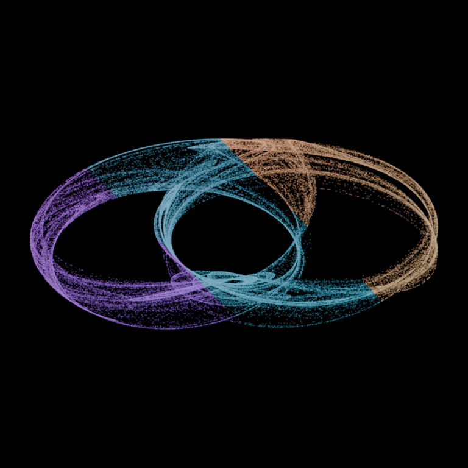

# Generative Art Lab for Blender 0.5

Generative Art Lab ports ideas from the p5.js sketches into one installable
Blender sidebar. It is built for the same workflow as the browser experiments:
choose a comprehensible starting point, change knobs, try a seed, let the full
calculation finish, and keep the results that feel worth capturing.



No Python editing is needed for ordinary use. All three generators live in
**3D Viewport → Sidebar → Generative Art**:

- **Surface Flow Painter** follows invisible seeded paths over a sphere and
  deposits disconnected dots or dashes. The guides never render.
- **L-System Sculpture** ports the Tree, Fern, Coral, and Snowflake grammars
  from `lsystem_tree_interactive.html` into editable branching curves. It adds
  seeded 3D spread, branch shrink, thickness, and taper.
- **Strange Attractor** ports the Clifford, De Jong, and Lorenz equations from
  `strange_attractor_interactive.html`. A dense geometry-node point cloud takes
  the place of millions of translucent canvas dots.

## First-time installation

These steps were verified in Blender 5.2.0 LTS on **mini**:

1. Open Blender.
2. Choose **Edit → Preferences**, then select **Extensions**.
3. Open the Extensions menu and choose **Install from Disk…**.
4. Select `blender/dist/flow_field_painter-0.5.0.zip`. Do not unzip it.
5. Generative Art Lab should enable automatically. If it does not, find it
   under **Add-ons** and enable its checkbox.
6. Close Preferences and open `blender/generative_art_lab_starter.blend`.
7. In the large 3D view, press `N` if the sidebar is hidden, then select the
   **Generative Art** tab.
8. Use **File → Save As…** to make a personal working copy.

The starter opens with a fully accumulated 140,000-point Clifford attractor.
The extension replaces only its own live generated collection. Mesh copies and
objects you add yourself are preserved.

## The shared workflow

1. Choose a **Generator** and a starting preset, then click **Apply Preset &
   Generate**.
2. Adjust the visible quick controls and click the large **Generate Full…**
   button. Collapsed sections expose every generator-specific knob.
3. Click **Render PNG** to save the image and its exact JSON recipe. **Make Mesh
   Copy** preserves converted curve geometry when the current generator uses
   curves.

**New Seed** changes the repeatable starting condition. **Mutate** nudges a
small set of high-impact controls while retaining the current seed. Generation
always produces the finished result; there is no animation timeline to wait on.

If **Save To** is blank, PNGs and recipes go in a `renders` folder beside the
open `.blend` file.

## What the unfamiliar controls mean

### Surface Flow Painter

- **Painters / Path Length:** coverage and how long each invisible guide runs.
- **Pattern Scale:** low makes broad bends; high makes busier turns.
- **Flow Smoothness:** high produces graceful paths.
- **Mark Spacing / Mark Chance:** how often a guide deposits visible paint.
- **Opacity Pattern:** even, faded path ends, spatial clouds, or repeating
  pulses.

### L-System Sculpture

- **Growth Rounds:** repeatedly rewrites the grammar. One extra round can
  multiply the branch count, so generation is capped at 30,000 branches.
- **Branch Angle:** how far new growth turns from its parent.
- **Branch Shrink:** how quickly nested side growth gets shorter.
- **Angle Wander:** seeded irregularity rather than perfect symmetry.
- **3D Spread:** zero stays planar; higher values twist branches around the
  trunk.
- **Thickness Taper:** low values make tips become thin quickly.

### Strange Attractor

- **Points:** the direct equivalent of “let it cook.” More points make the
  orbit denser but cost time and memory. The UI allows 5,000–1,000,000; Lorenz
  is capped at 500,000.
- **Coefficient A/B/C/D:** the equation parameters. Tiny changes can produce a
  new structure—or collapse the orbit—so presets are useful anchors.
- **Point Size / Point Opacity:** low opacity builds brightness in places the
  orbit revisits frequently.
- **Color From:** position, orbit age, or movement speed.
- **Depth From:** Flat Image preserves the p5.js projection; Orbit Age,
  Movement Speed, and Ribbon Fold turn it into actual 3D point geometry.

## Command-line flow-field generation

The original flow painter still has a reusable batch entry point:

```zsh
/Applications/Blender.app/Contents/MacOS/Blender \
  --background --factory-startup \
  --python blender/flow_field_prototype.py -- \
  --seed 42 --render
```

## Development checks

All commands below target zsh on mini and were run with Blender 5.2.0 LTS:

```zsh
/Applications/Blender.app/Contents/MacOS/Blender \
  --background --factory-startup --python-exit-code 1 \
  --python blender/tests/test_flow_field_painter.py

/Applications/Blender.app/Contents/MacOS/Blender \
  --background --factory-startup --python-exit-code 1 \
  --python blender/tests/test_lsystem_sculpture.py

/Applications/Blender.app/Contents/MacOS/Blender \
  --background --factory-startup --python-exit-code 1 \
  --python blender/tests/test_strange_attractor.py
```
