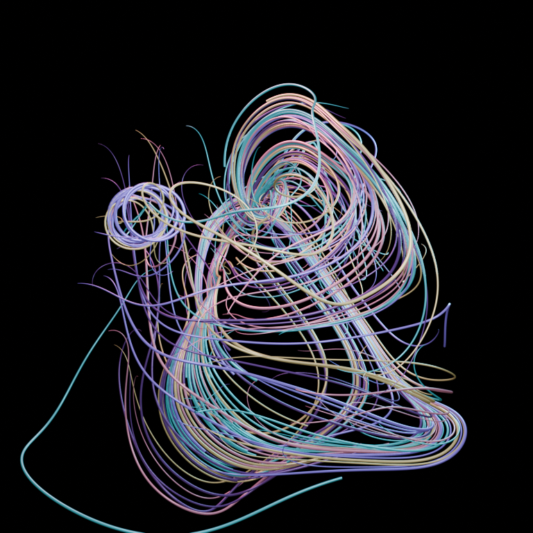

# Blender generative-art prototypes

## Flow Field Painter 0.2

Flow Field Painter turns the accumulating flow-field idea into animated 3D
curve geometry. Seeded agents move through a noise field and leave tapered
trails. Blender's timeline is the cooking clock: an early frame is sparse, and
a later frame reveals more of the same deterministic painting.



Version 0.2 adds a beginner-facing Blender sidebar. No Python editing is needed
for ordinary use.

## First-time installation

These steps target the verified Blender 5.2 interface on mini:

1. Open Blender.
2. Choose **Edit → Preferences**, then select **Extensions**.
3. Open the Extensions menu and choose **Install from Disk…**.
4. Select `blender/dist/flow_field_painter-0.2.0.zip`. Do not unzip it first.
5. Flow Field Painter should enable automatically. If it does not, find it
   under **Add-ons** and enable its checkbox.
6. Close Preferences and open `blender/flow_field_painter_starter.blend`.
7. In the large 3D view, press `N` if its sidebar is hidden, then select the
   **Generative Art** tab.
8. Use **File → Save As…** to make a personal working copy before experimenting.

The starter scene opens on seed 42 at frame 132. It is safe to experiment: the
extension replaces only its live generated collection. Frozen captures and
objects you add yourself are preserved.

## The three-step workflow

1. Change the seed or any knobs, then click **Generate & Play**.
2. Let it cook. Click **Pause** at an interesting frame, or drag the Cooking
   Frame slider to inspect another moment.
3. Click **Freeze This Moment** to preserve editable mesh geometry, or
   **Render PNG** to save the picture and its exact JSON recipe.

**New Seed** gives the current knobs a completely new starting condition.
**Mutate Knobs** keeps the seed but nudges several motion controls, creating a
related result. **Replay** returns to frame 1 without rebuilding anything.

Knobs are grouped into collapsed sections:

- **Motion Knobs:** trail count and length, cooking time, turbulence, momentum,
  orbit, center pull, vertical lift, and painting size.
- **Look Knobs:** palette, tube thickness, metallic response, roughness, and
  glow.
- **Camera & Output:** view direction, distance, lens, and PNG resolution.

Most knob changes take effect the next time **Generate & Play** is clicked.
Dragging the Cooking Frame and replaying work immediately because the trail
growth is already animated.

If **Save To** is blank, rendered PNGs and recipes go into a `renders` folder
beside the open `.blend` file. Every render gets a matching `.json` file.

## Command-line generation

The same reusable generator can run without the UI for batches or remote
machines. It produces an editable `.blend`, a JSON recipe, and optionally a PNG
in `blender/output/`.

### Run on mini (zsh)

```zsh
/Applications/Blender.app/Contents/MacOS/Blender \
  --background --factory-startup \
  --python blender/flow_field_prototype.py -- \
  --seed 42 --capture-frame 132 --render
```

Available command-line controls:

```text
--seed INTEGER
--agents INTEGER
--steps INTEGER
--capture-frame INTEGER
--growth-frames INTEGER
--render-size INTEGER
--output-dir PATH
--render
```

The same script is intended to run on desktop once Blender 5.2 is installed
there. Its Windows invocation has not yet been verified, so it is not presented
as a paste-ready command.

## Development checks

The integration smoke test registers the extension, generates twice, confirms
an unrelated user object survives, freezes a partial frame into meshes, and
renders a PNG with a matching recipe:

```zsh
/Applications/Blender.app/Contents/MacOS/Blender \
  --background --factory-startup --python-exit-code 1 \
  --python blender/tests/test_flow_field_painter.py
```
